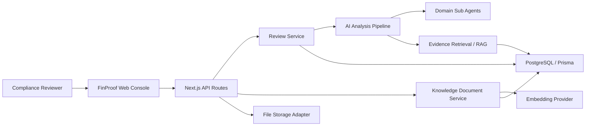

# FinProof Agent

금융 광고 심의 업무를 위한 AI 컴플라이언스 에이전트 서비스입니다.

FinProof Agent는 금융 홍보물, 상품 설명서, 약관, 내부 체크리스트 등 심의 요청 자료를 하나의 패키지로 받아 AI가 위험 표현을 선분석하고, 관련 근거 문서를 연결하며, 심의자가 최종 판단과 보고서 작성을 빠르게 진행할 수 있도록 돕는 B2B SaaS 콘솔입니다.

> Review Faster. Decide Smarter.

## Project Overview

금융 광고 심의 담당자는 광고 문구와 상품 조건, 내부 정책, 법령, 과거 심의 이력을 반복적으로 대조해야 합니다. 이 과정은 자료가 흩어져 있고 판단 근거를 기록해야 하기 때문에 시간이 오래 걸립니다.

FinProof Agent는 이 반복 업무를 하나의 워크플로우로 묶습니다.

- 심의 요청 패키지 업로드
- 홍보물, 상품자료, 약관, 체크리스트 자동 분류
- 과장 표현, 필수 고지 누락, 상품 조건 불일치 위험 선분석
- 내부 정책, 법령, 상품자료, 과거 심의 사례 근거 연결
- RAG 기반 대화형 검토
- 승인, 수정 요청, 반려, 보류 등 Human-in-the-loop 최종 판단
- 검토 이력과 근거가 포함된 심의 보고서 생성

## Key Features

### AI Review Workflow

심의 요청부터 보고서 생성까지의 흐름을 AI Agent 기반 업무 단계로 구성했습니다.

1. 패키지 업로드
2. 자동 분류
3. 위험 선분석
4. 위험 영역 하이라이트
5. 근거 확인
6. 대화형 검토
7. 최종 판단
8. 산출물 생성

### Evidence-Based Review

심의자가 단순히 AI 결과를 받는 것이 아니라, 각 이슈에 연결된 근거 문서를 함께 확인할 수 있도록 설계했습니다.

- 내부 광고 심의 기준
- 금융소비자보호 체크리스트
- 상품 설명서
- 법령 및 규정 문서
- 과거 심의 사례

### Human-in-the-loop Decision

AI는 위험 후보와 근거를 제시하고, 최종 판단은 심의 담당자가 수행합니다.

- 승인
- 수정 요청
- 반려
- 보류
- 심의 이력 기록

### B2B SaaS Console UI

금융기관 컴플라이언스 담당자가 사용할 수 있는 업무용 콘솔 경험을 목표로 디자인했습니다.

- 다크 네이비/블루 기반 랜딩 페이지
- 스크롤 기반 서비스 워크플로우 소개
- 심의 콘솔, 지식문서, 대시보드 라우팅
- 상태 badge, table, filter, empty state 중심의 운영형 UI
- 반응형 레이아웃과 CSS keyframes 기반 subtle animation

## Tech Stack

| Area | Stack |
| --- | --- |
| Frontend | Next.js App Router, React, TypeScript |
| Styling | CSS, responsive layout, CSS keyframes |
| Backend | Next.js Route Handlers, server modules |
| Database | Prisma, PostgreSQL |
| AI/RAG | AI review service, embedding provider, model router, evidence retrieval |
| Storage | Local metadata storage, S3 adapter support |
| Testing | Vitest, Testing Library, ESLint |
| Deployment Ready | EC2/systemd, Supabase Postgres, S3 configuration support |

## Architecture



## Main Routes

| Route | Purpose |
| --- | --- |
| `/` | Product landing page |
| `/reviews` | Review queue and review history |
| `/reviews/new` | New review package intake |
| `/reviews/[id]` | Review workbench |
| `/knowledge-documents` | Knowledge document registry |
| `/dashboard` | Compliance dashboard |

## API Surface

주요 API는 `/api/v1` 아래에 구성되어 있습니다.

- `GET /api/v1/review-cases`
- `POST /api/v1/review-cases`
- `GET /api/v1/review-cases/:caseId`
- `POST /api/v1/review-cases/:caseId/analysis/start`
- `GET /api/v1/review-cases/:caseId/analysis/status`
- `GET /api/v1/review-cases/:caseId/issues`
- `GET /api/v1/issues/:issueId/evidence`
- `GET /api/v1/knowledge-documents`
- `POST /api/v1/knowledge-documents`
- `POST /api/v1/review-cases/:caseId/reports/generate`

## Getting Started

### 1. Install

```bash
npm install
```

### 2. Run Development Server

```bash
npm run dev
```

Open:

```text
http://localhost:3000
```

### 3. Run Quality Checks

```bash
npm run lint
npm run test
npm run build
```

## Local Persistence Mode

기본 실행은 deterministic mock review store를 사용합니다. 별도 DB 없이 랜딩 페이지와 주요 콘솔 UI를 확인할 수 있습니다.

PostgreSQL 기반 Prisma store를 사용하려면 환경 변수를 설정하고 마이그레이션을 실행합니다.

```bash
docker compose up -d postgres
npm run db:generate
npm run db:migrate
npm run db:seed
FINPROOF_REVIEW_STORE=prisma npm run dev
```

실제 운영 환경에서는 `.env`에 DB URL, AI provider key, storage 설정 등을 주입해야 합니다. 민감 정보는 절대 GitHub에 커밋하지 않습니다.

## Environment Variables

대표 환경 변수는 아래와 같습니다.

```bash
FINPROOF_AUTH_MODE=jwt
FINPROOF_REVIEW_STORE=prisma
FINPROOF_MODEL_PROVIDER=router
FINPROOF_EMBEDDING_PROVIDER=openai
FINPROOF_RAG_PROVIDER=postgres
FINPROOF_ANALYSIS_EXECUTION_MODE=queued
FINPROOF_STORAGE_ADAPTER=s3
DATABASE_URL=postgresql://...
DIRECT_URL=postgresql://...
OPENAI_API_KEY=...
```

## Portfolio Highlights

이 프로젝트는 단순한 CRUD 대시보드가 아니라 금융 광고 심의라는 도메인 문제를 AI Agent 워크플로우로 풀어낸 서비스형 프로젝트입니다.

- 도메인 특화 AI Agent UX 설계
- 금융 컴플라이언스 담당자를 위한 콘솔형 정보 구조
- 근거 기반 판단을 위한 RAG/evidence retrieval 구조
- 심의 이력과 보고서 생성을 고려한 백엔드 모델링
- 실제 SaaS처럼 보이는 랜딩, review console, knowledge document UI
- API, DB, storage, AI provider를 분리한 확장 가능한 서버 구조

## Recent UI Refresh

최근 프론트엔드에서는 포트폴리오 데모에 적합하도록 제품 랜딩과 콘솔 UI를 개선했습니다.

- FinProof 로고 적용
- 다크 네이비/블루 그라데이션 랜딩
- 서비스 흐름을 설명하는 스크롤 기반 워크플로우 섹션
- 근거 문서, 내부 정책, 심의 이슈를 보여주는 제품 카드
- 마지막 CTA 섹션: 심의 시작하기
- CSS keyframes 기반 애니메이션

## Verification

최근 검증 결과:

```bash
npm run lint
npm run build
```

빌드 과정에서 Next/Turbopack의 서버 파일 추적 경고가 표시될 수 있지만, production build는 정상 완료됩니다.

## License

Portfolio project. All rights reserved unless a separate license is added.
