# FinProof Agent

> Review Faster. Decide Smarter.

FinProof Agent는 금융 광고·홍보물 심의 업무를 위한 AI Agent 기반 준법심의 워크플로우 서비스입니다. 심의 요청자가 광고 시안, 상품 설명서, 약관, 금리표, 내부 체크리스트 등 자료 패키지를 업로드하면 AI가 자료를 자동 분류하고, 위험 표현을 선분석하며, RAG 기반 근거 문서와 수정 의견 초안을 제공해 준법심의자의 판단 과정을 지원합니다.

AI는 최종 승인자가 아니라 심의 보조자입니다. 위험 후보, 근거, 의견 초안을 제시하고, 승인·수정 요청·반려·보류 등 최종 판단은 사람이 수행하는 Human-in-the-loop 구조를 따릅니다.

## Problem

금융 홍보물 심의는 광고 문구, 상품 조건, 약관, 내부 정책, 법령, 과거 심의 사례를 반복적으로 대조해야 하는 업무입니다. 이 과정은 다음 문제를 가집니다.

- 심의 자료가 여러 파일과 문서에 흩어져 있어 검토 시간이 길어짐
- 심의자와 검토 시점에 따라 판단 품질이 달라질 수 있음
- 필수 고지 누락, 과장 표현, 상품 조건 불일치 같은 위험을 수작업으로 찾아야 함
- 판단 근거와 수정 의견을 다시 문서화해야 해 반복 업무가 많음
- 규정 변경이나 사내 기준 변경이 현업 심의에 늦게 반영될 수 있음

FinProof Agent는 이 병목을 “자료 업로드 → AI 선분석 → 근거 연결 → 심의자 판단 → 산출물 생성” 흐름으로 통합합니다.

## Core Workflow

1. **패키지 업로드**  
   홍보물, 문구, 약관, 상품 설명서, 체크리스트, URL 등 심의 자료를 하나의 패키지로 제출합니다.

2. **자동 분류 및 누락 자료 게이트**  
   AI가 홍보물 시안, 상품자료, 약관, 체크리스트, 금리표 등을 분류하고 상품군별 필수 자료 누락 여부를 확인합니다.

3. **AI 위험 선분석**  
   도메인 Sub Agent가 과장 표현, 필수 고지 누락, 상품 조건 불일치, 시각적 강조 불균형 등 위험 후보를 검토합니다.

4. **원본 홍보물 하이라이트**  
   문제가 발생한 문구 또는 영역을 원본 포스터 위에 표시하고, 마우스 hover 시 문제 원인과 수정 방향을 확인할 수 있습니다.

5. **RAG 기반 근거 확인**  
   법령, 사내 기준, 상품자료, 과거 심의 사례를 검색해 이슈별 Evidence로 연결합니다.

6. **대화형 검토**  
   심의자는 선택한 이슈에 대해 RAG 기반 채팅으로 추가 쟁점을 확인합니다. 답변은 연결된 근거 범위 안에서 제공되도록 설계했습니다.

7. **Human-in-the-loop 최종 판단**  
   심의자가 승인, 수정 요청, 반려, 보류 중 최종 조치를 선택하고 판단 메모를 남깁니다.

8. **산출물 생성**  
   심의 리포트, 반려/수정 의견 초안, 근거 출처 목록, 심의 이력을 생성·저장합니다.

## AI Agent Architecture

FinProof Agent는 단일 LLM 호출이 아니라 업무 단계를 분리한 Agent/RAG 구조를 목표로 합니다.

```mermaid
flowchart LR
  Upload["Review Package Upload"] --> Classify["File Classification"]
  Classify --> OCR["OCR / Text Extraction"]
  OCR --> RAG["RAG Retrieval"]
  RAG --> Evidence["Evidence Candidates"]
  Evidence --> Agents["Domain Sub Agents"]
  Agents --> Lead["Main Compliance Agent"]
  Lead --> Issues["Risk Issues + Highlights"]
  Issues --> Workbench["Reviewer Workbench"]
  Workbench --> Decision["Human Final Decision"]
  Decision --> Report["Opinion Draft / Report"]
```



### Sub Agent Roles

| Agent | Responsibility |
| --- | --- |
| Creative Review Agent | 홍보 문구, 혜택 표현, 시각적 강조, 소비자 오인 가능성 검토 |
| Product Terms Agent | 상품설명서, 약관, 금리표와 광고 문구의 조건 일치 여부 검토 |
| Regulation Agent | 금융광고 법규와 감독 기준에 대한 위험 신호 검토 |
| Internal Policy Agent | 사내 심의 기준, 체크리스트, 금지 표현 기준 검토 |
| Case Search Agent | 과거 유사 심의 사례 검색 및 참고 근거 제공 |
| Evidence Verification Agent | 연결된 근거가 실제 판단을 뒷받침하는지 재검증 |
| Main Compliance Agent | Sub Agent 결과를 통합하고 최종 위험 후보를 정리 |

## Key Features

### Review Workbench

- 3-pane 구조: 이슈 목록, 원본 홍보물 미리보기, 근거/의견 패널
- 위험도 badge: 참고, 주의, 위험, 반려 권고
- 이슈 필터링 및 선택 이슈 상세 확인
- 원본 포스터 위험 영역 하이라이트
- hover/focus 기반 문제 원인 tooltip
- 심의자 위험도 조정 및 판단 메모 저장

### Knowledge Document Registry

- 법령, 사내 정책, 체크리스트, 가이드 문서 등록
- 승인 상태 관리
- RAG 검색 대상이 되는 지식문서 관리 기반
- 계열사/상품군별 심의 기준 확장 가능 구조

### RAG and Evidence Retrieval

- OCR/Text 추출 결과를 기반으로 근거 후보 검색
- 내부 정책, 상품자료, 과거 사례를 Evidence로 연결
- 관련도 점수와 출처 메타데이터 표시
- 근거 기반 채팅과 의견 초안 생성에 재사용

### Report and Draft Generation

- 선택 이슈와 근거를 바탕으로 의견 초안 생성
- 심의 리포트 Markdown 다운로드
- 심의 판단, 근거, 채팅 맥락을 산출물에 반영

### Portfolio Landing

- B2B 금융 SaaS 스타일 랜딩 페이지
- 서비스 흐름을 설명하는 스크롤 기반 섹션
- FinProof 로고와 슬로건 적용
- CSS keyframes 기반 애니메이션

## Tech Stack

| Area | Stack |
| --- | --- |
| Frontend | Next.js App Router, React, TypeScript |
| Styling | CSS, responsive layout, CSS keyframes |
| Backend | Next.js Route Handlers, server modules |
| Database | PostgreSQL, Prisma |
| Vector/RAG | PostgreSQL + pgvector-ready schema, evidence retrieval layer |
| AI Layer | Model router, OCR provider, embedding provider, rerank provider, review AI service |
| Storage | Local metadata storage, AWS S3 adapter support |
| Auth/RBAC | Demo role mode, JWT/JWKS-ready auth, requester/reviewer/compliance admin roles |
| Testing | Vitest, Testing Library, ESLint |
| Deployment | EC2 + systemd runbook, GitHub Actions CI, environment-based provider switching |

## Main Routes

| Route | Purpose |
| --- | --- |
| `/` | Product landing page |
| `/reviews` | Review queue and review history |
| `/reviews/new` | New review package intake |
| `/reviews/[id]` | Review workbench |
| `/knowledge-documents` | Knowledge document registry |
| `/dashboard` | Compliance dashboard |

## API Surface

Representative API routes:

- `GET /api/v1/review-cases`
- `POST /api/v1/review-cases`
- `GET /api/v1/review-cases/:caseId`
- `POST /api/v1/review-cases/:caseId/analysis/start`
- `GET /api/v1/review-cases/:caseId/analysis/status`
- `GET /api/v1/review-cases/:caseId/issues`
- `PATCH /api/v1/review-cases/:caseId/issues/:issueId`
- `POST /api/v1/review-cases/:caseId/chat`
- `POST /api/v1/review-cases/:caseId/draft`
- `POST /api/v1/review-cases/:caseId/reports/generate`
- `GET /api/v1/knowledge-documents`
- `POST /api/v1/knowledge-documents`
- `POST /api/v1/knowledge-documents/:documentId/approve`

## Getting Started

### 1. Install

```bash
npm install
```

### 2. Run Development Server

```bash
npm run dev
```

Open:

```text
http://localhost:3000
```

For local demo data:

```bash
FINPROOF_ENABLE_SAMPLE_DATA=true FINPROOF_REVIEW_STORE=mock npm run dev
```

### 3. Run Quality Checks

```bash
npm run lint
npm run test
npm run build
```

## Environment Configuration

The app is designed to run in deterministic mock mode for local demo and CI, while supporting production-oriented providers through environment variables.

```bash
FINPROOF_AUTH_MODE=jwt
FINPROOF_REVIEW_STORE=prisma
FINPROOF_MODEL_PROVIDER=router
FINPROOF_OCR_PROVIDER=http
FINPROOF_EMBEDDING_PROVIDER=openai
FINPROOF_RAG_PROVIDER=postgres
FINPROOF_RERANK_PROVIDER=http
FINPROOF_ANALYSIS_EXECUTION_MODE=queued
FINPROOF_STORAGE_ADAPTER=s3
DATABASE_URL=postgresql://...
DIRECT_URL=postgresql://...
OPENAI_API_KEY=...
AWS_REGION=ap-northeast-2
FINPROOF_S3_BUCKET=...
```

Do not commit secrets. Use `.env.example` as the safe reference file.

## Repository Notes

This repository is organized as a portfolio-ready implementation of the FinProof MVP concept. It includes frontend UX, API routes, mock-first local execution, Prisma-backed persistence structure, AI/RAG service boundaries, storage adapters, and deployment operation notes.

Current implementation emphasizes:

- AI Agent workflow design for financial advertising compliance review
- RAG/evidence retrieval boundaries for explainable review decisions
- Human-in-the-loop final judgment model
- Review workbench UX with issue highlight, evidence panel, chat, draft, and report flows
- Backend separation for auth, storage, analysis, review service, knowledge ingestion, and model providers
- Deterministic local mode for reproducible demos and CI

## Reference Materials

- [MVP Proposal](https://drive.google.com/file/d/1A3IgnXbmqIJ9ipEA9pxmU0aCRvBgLZKA/view?usp=drive_link) - product concept and MVP proposal
- [Feature Specification](https://drive.google.com/file/d/1_D-g7zaAjWgqM4iv-JwLSXAqsvT-Vp_m/view?usp=drive_link) - AI Agent workflow and feature specification
- [Demo Video](https://drive.google.com/file/d/1QNQ8tu65CTFtJVJl0eBMc0uJeFag6KrW/view?usp=drive_link) - service demonstration video

## Verification

Recent verification:

```bash
npm run lint
npm run test
npm run build
```

The production build can show a Turbopack file tracing warning related to server-side storage imports. The build still completes successfully.

## Disclaimer

This project is a portfolio/MVP implementation. A real financial institution deployment requires updated internal policies, legal/compliance review, security controls, model governance, privacy review, and production-grade monitoring.

## License

Portfolio project. All rights reserved unless a separate license is added.
